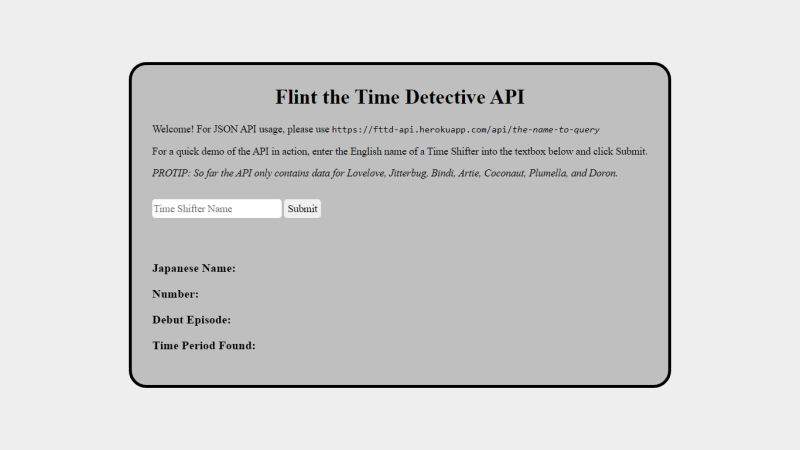

# Flint the Time Detective API
The (First? Only?) Flint the Time Detective API. Make a request with a Time Shifter's name and the API will respond with information about it.

**Link to project:** https://fttd-api.herokuapp.com

## How It's Made:

**Tech used:** HTML, CSS, JavaScript, and Node.js

Both the API and its homepage are hosted on a Node.js server built using Express.js. The API responds to requests with data pulled from an internal object, without the need for an external database. In addition to instructing how to query the API, the homepage also includes a working demo of calling the API and displaying the data it responds with.

## Optimizations

In the future I would like to flesh out the API by adding data for all of the Time Shifters to it. Additionally, the API's homepage could benefit from enhanced styling.

## Lessons Learned:

I built this project to help strengthen my understanding of APIs and Node.js, but I also ended up learning quite a lot about Express.js in the process. I was pleasantly surprised by how much it simplifies coding a server (in contrast to using only the core Node.js modules to do so). And it also makes handling CORS requests a breeze!

## How To Run It Locally:

1. Ensure that you have Git and Node.js installed.
2. Clone this repository (e.g., with `git clone https://github.com/warnshouse/fttd-api.git`).
3. Move into the directory with `cd fttd-api`.
4. Install the necessary dependencies with `npm install`.
5. Start the server with `npm start`.
6. Navigate to `localhost:8000` in your web browser and you're set!